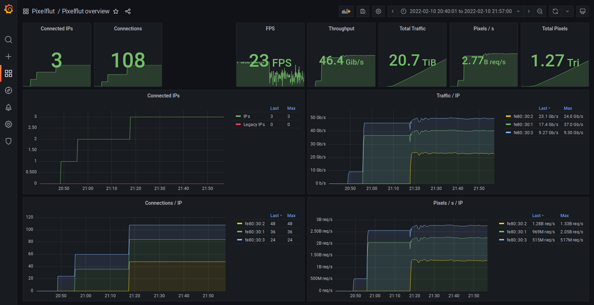

# breakwater
breakwater is a very fast [Pixelflut](https://wiki.cccgoe.de/wiki/Pixelflut) server written in Rust. It is heavily inspired by [Shoreline](https://github.com/TobleMiner/shoreline).

It claims to be **the fastest Pixelflut server in existence** - at least at the time of writing 02/2022.


# Features
1. Accepts Pixelflut commands
2. Provides VNC server so that everybody can watch
3. Exposes Prometheus metrics
4. IPv6 and legacy IP support

# Available Pixelflut commands
Commands must be sent newline-separated, for more details see [Pixelflut](https://wiki.cccgoe.de/wiki/Pixelflut)
* `HELP`: Prints a help text with the available commands.
* `PX x y rrggbb`: Color the pixel (x,y) with the given hexadecimal color, e.g. `PX 10 10 ff0000`
* `PX x y rrggbbaa`: Color the pixel (x,y) with the given hexadecimal color rrggbb (alpha channel is ignored for now), e.g. `PX 10 10 ff0000ff`
* `PX x y`: Get the color value of the pixel (x,y), e.g. `PX 10 10`
* `SIZE`: Get the size of the drawing surface

# Usage
The easiest way is to continue with the provided [Ready to use Docker setup](#run-in-docker-container) below.

If you prefer the manual way (the best performance) you need to have [Rust installed](https://www.rust-lang.org/tools/install).
You may need to install some additional packages with `sudo apt install pkg-config libvncserver-dev `
Then you can directly run the server with
```bash
cargo run --release
```
The default settings should provide you with a ready-to-use server.

| Port | Description                 |
|------|-----------------------------|
| 1234 | Pixelflut server            |
| 5900 | VNC server                  |
| 9100 | Prometheus metrics exporter |

The get a list of options try
```bash
cargo run --release -- --help
```
<details>
  <summary>Output</summary>

```bash
cargo run --release -- --help
    Finished release [optimized] target(s) in 0.03s
     Running `target/release/breakwater --help`
breakwater 0.0.1

USAGE:
    breakwater [OPTIONS]

OPTIONS:
    -f, --fps <FPS>
            Frames per second the VNC server should aim for [default: 30]

        --font <FONT>
            The font used to render the text on the screen. Should be a ttf file [default:
            Arial.ttf]

    -h, --height <HEIGHT>
            Height of the drawing surface [default: 720]

        --help
            Print help information

    -l, --listen-address <LISTEN_ADDRESS>
            Listen address to bind to. The default value will listen on all interfaces for IPv4 and
            v6 packets [default: [::]:1234]

    -p, --prometheus-listen-address <PROMETHEUS_LISTEN_ADDRESS>
            Listen address zhe prometheus exporter should listen om. The default value will listen
            on all interfaces for IPv4 and v6 packets [default: [::]:9100]

    -t, --text <TEXT>
            Text to display on the screen. The text will be followed by "on <listen_address>"
            [default: "Breakwater Pixelflut server"]

    -v, --vnc-port <VNC_PORT>
            Port of the VNC server [default: 5900]

    -V, --version
            Print version information

    -w, --width <WIDTH>
            Width of the drawing surface [default: 1280]
```
</details>

You can also build the binary with `cargo build --release`. The binary will be placed at `target/release/breakwater`.

## Compile time features
Breakwater also has some compile-time features for performance reasons.
You can get the list of available features by looking at the [Cargo.toml](Cargo.toml).
To e.g. count the actual pixels colored by every IP enable the future `count_pixels` as follows.
Please note that this will have a very larger performance penality.
```bash
cargo run --release --features count_pixels
```

# Run in docker container
This command will start the Pixelflut server in a docker container
```bash
docker run -p 1234:1234 -p 5900:5900 -p 9100:9100 sbernauer/breakwater # --help
```
The following command stops the server again (if there are some problems with SIGINT)
```bash
docker ps -q --filter ancestor=sbernauer/breakwater | xargs docker kill
```

# Ready to use Docker compose setup
The ready to use Docker compose setup contains the Pixelflut server, a prometheus server and a Grafana for monitoring.
Use the following command to start the whole setup
```bash
docker-compose up
```
You should now have access to the following services

| Port | Description                 |
|------|-----------------------------|
| 1234 | Pixelflut server            |
| 5900 | VNC server                  |
| 9100 | Prometheus metrics exporter |
| 9090 | Prometheus server           |
| 80   | Grafana                     |

If you visit the Grafana server (user=admin, password=admin) you will have access to dashboards like the dashboard below.


# Performance
## Laptop
My Laptop has a `Intel(R) Core(TM) i7-8850H CPU @ 2.60GHz` (6 Cores/12 Threads) and 2 DDR4 RAM modules with 16 GB each and 2667 MT/s.
The Pixelflut-server and Pixelflut-client [Sturmflut](https://github.com/TobleMiner/sturmflut) both run on my Laptop using 24 connections.
These are the results of different Pixelflut servers:

| Server                                                                  | Language | Traffic during first 30s | When thermal throttling |
|-------------------------------------------------------------------------|----------|--------------------------|-------------------------|
| [Pixelnuke](https://github.com/defnull/pixelflut/tree/master/pixelnuke) | C        | 1.1 Gbit/s               | 1 Gbit/s                |
| [Pixelwar](https://github.com/defnull/pixelflut/tree/master/pixelwar)   | Java     | 2.1 Gbit/s               | 1.6 Gbit/s              |
| [pixelpwnr-server](https://github.com/timvisee/pixelpwnr-server)        | Rust     | 6.3 Gbit/s               | 4.6 Gbit/s             |
| [Shoreline](https://github.com/TobleMiner/shoreline)                    | C        | 15 Gbit/s                | 12 Gbit/s               |
| [Breakwater](https://github.com/sbernauer/breakwater)                   | Rust     | 30 Gbit/s                | 22 Gbit/s               |

## Server
The server has two `Intel(R) Xeon(R) CPU E5-2660 v2 @ 2.20GHz` processors with 10 cores / 20 threads each.
Another server was used as a Pixelflut-client [Sturmflut](https://github.com/TobleMiner/sturmflut).
The servers were connected with two 40G and one 10G links, through which traffic was generated.


| Server                                                | Language | Sustainable traffic |
|-------------------------------------------------------|----------|---------------------|
| [Shoreline](https://github.com/TobleMiner/shoreline)  | C        | 34 Gbit/s           |
| [Breakwater](https://github.com/sbernauer/breakwater) | Rust     | 52 Gbit/s           |

## Usage of [Tokio](https://crates.io/crates/tokio)
You can find a prototype with Tokio in the `tokio` branch.
Performance measurements have shown that the usage of Tokio decreased the average performance from 22.9 to 21.6 Gbit/s.
<details>
  <summary>Used benchmark</summary>

```bash
for i in $(seq 1 20); do
    for branch in master tokio; do
        git checkout $branch
        cargo run --release >/dev/null 2>/dev/null & sleep 2; ../sturmflut/sturmflut 127.0.0.1 ../sturmflut/cat.jpg -t 24 >/dev/null 2>/dev/null & sleep 10; bmon -b -p lo -o ascii:quitafter=3 | tail -n 1 | awk '{ print $2 }' | tee -a "perf/$branch"; killall sturmflut; killall breakwater
        sleep 1
    done
done
```
</details>


# TODOs
* Implement Alpha channel feature. For performance reasons there should be a compile-time switch (similar to `#ifdef` in C)
